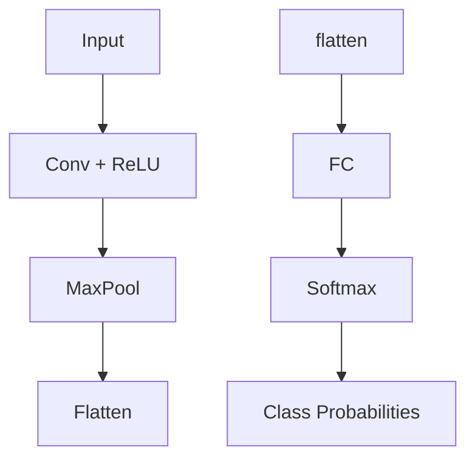
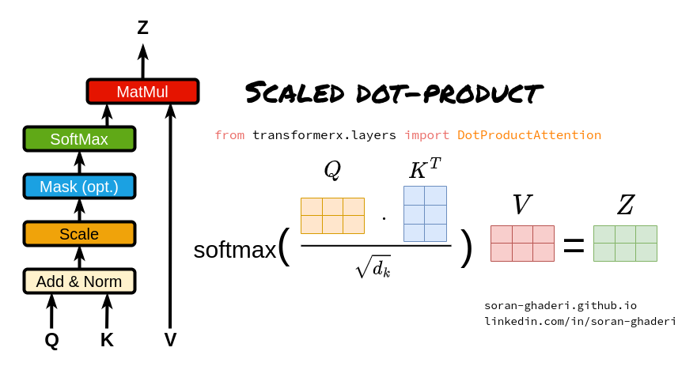
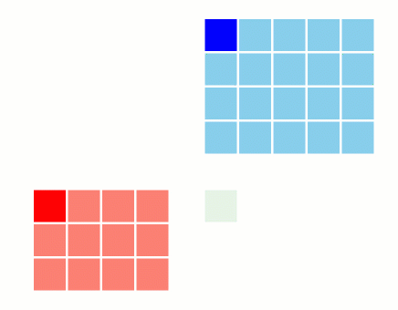
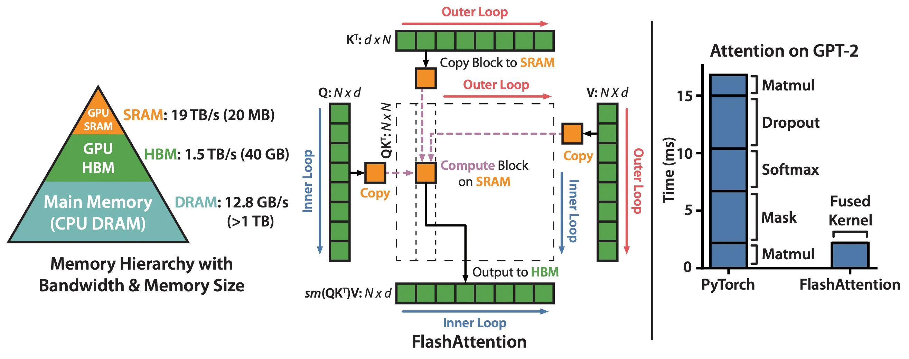

$$
\Huge
\text{softmax}(x)_i = \frac{e^{x_i}}{\sum_{j=1}^N e^{x_j}}
$$
蔡晓东，2026.1.8

Table of Contents
=================

* [SoftMax量化实现 (Pre-LLM)](#softmax量化实现-pre-llm)
* [SoftMax in LLM](#softmax-in-llm)
   * [分块矩阵乘法 SIMT (Single Instruction Multiple Thread)](#分块矩阵乘法-simt-single-instruction-multiple-thread)
   * [Online Softmax](#online-softmax)
   * [Self-Attention](#self-attention)
* [Recap](#recap)

<!-- Created by https://github.com/ekalinin/github-markdown-toc -->

# SoftMax量化实现 (Pre-LLM)
SoftMax通常在神经网络的最后一层，负责把一组实数转换成概率分布，通常跑在CPU/DSP上。



## 定点实现的挑战
1. 指数函数需要近似计算 (无FPU)
2. 累加和可能溢出，需要缩放 (8比特量化)
3. 除法要用倒数近似代替。
4. 最终要输出 int8 量化结果。

## 概要
- 先减最大值保证稳定，反量化
- 再用多项式 + 常数表近似指数，结果存在 Q1.31；
- 累加求和，用牛顿迭代近似求倒数，
- 最后 exp 乘倒数得到概率，并量化成 int8 输出。

## Softmax 的整体工作流程
[softmax 量化实现](./softmax.c)
### 数值稳定性处理

为了避免溢出，需要减去最大值，先找到最大值：

- 16x并行再reduce得到最大值 $x_{\max} = \max(x)$
- 计算差值并裁剪 $\text{diff}i = x_i - x_{\max}$。

### 指数求和
$\text{diff}_i = x_i - x_{\max}$，将 $\text{diff}$ 拆分为：
- 输入缩放: 输入 int8，通过 multiplier + shift 转成 Q5.26 定点值。
- 小数部分 $r \in [-\tfrac{1}{4}, 0)$
- 整数部分 $R \in {-\tfrac14, -\tfrac12, -1, -2, -4, -8, -16}$
- 指数近似：$e^r \approx 1 + r + \tfrac{r^2}{2} + \tfrac{r^3}{6} + \tfrac{r^4}{24}$，
- 然后乘上常数表中的 $e^R$。
- 得到结果在 Q1.31 格式：
$\text{exp}_i \approx e^{\text{diff}_i}, \quad 0 < \text{exp}_i \leq 1$
- 缩放并累加
    - $\text{exp}’_i = \frac{\text{exp}_i}{2^{12}}$
    - $\text{sum} = \sum_i \text{exp}’_i$

### 求倒数

牛顿迭代法求解 $y=1/x$ 等价于求解函数 $f(y) = xy - 1$

$\Large y_{k+1} = y_k - \frac{f(y_k)}{f'(y_k)}$

把 $\text{sum}$ 规格化：
$\text{norm} = \text{sum} \ll \text{headroom}, \quad \text{norm} \in [0.5, 1)$

构造：
$x = \text{norm} - 1, \quad x \in [-0.5, 0)$

用牛顿迭代计算：
$y_{k+1} = y_k(2 - x y_k)$

迭代 3 次，得到：
$\approx \frac{1}{\text{sum}}$

### 归一化并量化输出
$p_i = \frac{\text{exp}_i}{\text{sum}}$

实现时：
$\text{result}_i = \left(\frac{\text{p}_i \cdot \text{shifted scale}}{2^{\text{bits over unit}}}\right) - 128$

最后 pack 成 int8，范围 [−128,127]。

---

# SoftMax in LLM


softmax在网络中间层，前后都是大矩阵乘法。

## 分块矩阵乘法 SIMT (Single Instruction Multiple Thread)



[矩阵乘法的CUDA实现](./matrixMultiple.cu)

在矩阵乘法$ C = A B $中，如何对输入矩阵和输出矩阵进行分块（tiling）。

矩阵被划分为大小为 $T \times T$ 的小块（tile）。对于每一个输出矩阵的 tile，我们从左到右遍历与之相关的 (A) 中的 tile，同时从上到下遍历与之相关的 (B) 中的 tile，并将这些 tile 的数据从全局内存加载到片上内存中（图中以红色、绿色标出，整体片上内存占用为 $O(T^2)$。

在进行基于 tile 的部分矩阵乘法时，对于位置 $(i, j)$，我们从片上内存中加载该 tile 内所有 (k) 对应的 $A[i, k]$ 和 $B[k, j]$，并将 $A[i, k] \cdot B[k, j]$ 累加到片上内存中的 $C[i, j]$。

当一个 tile 的计算完成后，将片上内存中的 $C$ 的该 tile 写回主存，然后继续处理下一个 tile。

### 成立条件：**加法满足结合律**
$$
C_{ij} = \sum_{k=1}^K A_{ik} B_{kj}
$$

然而 $\text{softmax}(QK^\top)V$ 不满足结合律，因为softmax需要遍历整行。

## Online Softmax

### 背景
softmax是典型的 **memory bound** 算子:
- 计算量不大（exp + add + div）
- 访存量很大（多次读写）

$$
\Large
\text{softmax}(x)_i = \frac{e^{x_i-x_{\max}}}{\sum_{j=1}^N e^{x_j-x_{\max}}}
$$
### 三次遍历
```c
int softmax_3pass(float* x, int n, float* y)
{
    float x_max = FLT_MIN;
    float sum = 0;

    /* First Pass 求最大值*/
    for (int i = 0; i < n; ++i) {
        x_max = fmax(x[i], x_max);
    }

    /* Second Pass 求和*/
    for (int i = 0; i < n; ++i) {
        sum += exp(x[i] - x_max);
    }

    /* Third Pass 求概率*/
    for (int i = 0; i < n; ++i) {
        y[i] = exp(x[i] - x_max) / sum;
    }

    return 0;
}

```

### 两次遍历
**求和的递推公式**
$$
\Large
\begin{aligned}
d_i &= \sum_{j=1}^{i} e^{x_j - m_i} \\
&= \left( \sum_{j=1}^{i-1} e^{x_j - m_i} \right) + e^{x_i - m_i} \\
&= \left( \sum_{j=1}^{i-1} e^{x_j - m_{i-1}} \right) e^{m_{i-1}-m_i} + e^{x_i - m_i} \\
&= d_{i-1} \, e^{m_{i-1}-m_i} + e^{x_i - m_i}
\end{aligned}
$$

```c
int softmax_2pass(float* x, int n, float* y)
{
    float x_max = FLT_MIN;
    float sum_i = 0;

    /* First Pass */
    for (int i = 0; i < n; ++i) {
        float x_max_1 = x_max;
        x_max = fmax(x_max, x[i]);
        sum_i = sum_i * exp(x_max_1 - x_max) + exp(x[i] - x_max);
    }

    /* Second Pass */
    for (int i = 0; i < n; ++i) {
        y[i] = exp(x[i] - x_max) / sum_i;
    }

    return 0;
}

```
## Self-Attention

$$
\Large
\mathrm{Attention}(Q,K,V)=\mathrm{softmax}\left(\frac{QK^\top}{\sqrt{d_k}}\right)V
$$
[Self-Attention实现](./attention.py)
### 两次遍历 Self-Attention

**Notations**

- $Q[k,:]$：矩阵 $Q$ 的第 $k$ 行向量  
- $K^T[:, i]$：矩阵 $K^T$ 的第 $i$ 列向量  
- $O[k,:]$：输出矩阵 $O$ 的第 $k$ 行向量  
- $V[i,:]$：矩阵 $V$ 的第 $i$ 行向量  
- $\{o_i\}$：$\sum_{j=1}^{i} a_j V[j,:]$，用于存储部分聚合结果
  $A[k,j] \times V[j,:]$ 的行向量  

**伪代码**
$$
\Large
\begin{aligned}
\textbf{for }& i = 1 \textbf{ to } N \textbf{ do} \\
& x_i \leftarrow Q[k,:]\, K^T[:, i] \\
& m_i \leftarrow \max(m_{i-1}, x_i) \\
& d_i \leftarrow d_{i-1} e^{m_{i-1}-m_i} + e^{x_i-m_i} \\
\textbf{end}& \\
\textbf{for }& i = 1 \textbf{ to } N \textbf{ do} \\
& a_i \leftarrow \frac{e^{x_i-m_N}}{d_N} \\
& o_i \leftarrow o_{i-1} + a_i V[i,:] \\
\textbf{end}& \\
& \mathbf{O}[k,:] \leftarrow \mathbf{o}_N \\
\end{aligned}
$$

### 一次遍历 Self-Attention：直接算 $\text{softmax}(QK^\top)V$,
**$O$ 的递推公式**

$$
\Large
o_N = \sum_{j=1}^{N} \frac{e^{x_j - m_N}}{d_N} \, V[j,:]
$$


$$
\Large
\begin{aligned}
o_i &= \sum_{j=1}^{i} \frac{e^{x_j - m_i}}{d_i} \, V[j,:] \\
&= \left( \sum_{j=1}^{i-1} \frac{e^{x_j - m_i}}{d_i} \, V[j,:] \right) + \frac{e^{x_i - m_i}}{d_i} \, V[i,:] \\
&= \left( \sum_{j=1}^{i-1}    \frac{e^{x_j - m_{i-1}}}{d_{i-1}}    \frac{d_{i-1}}{d_i}    e^{m_{i-1}-m_i}    \, V[j,:] \right)   + \frac{e^{x_i - m_i}}{d_i} \, V[i,:] \\
&= \left( \sum_{j=1}^{i-1}    \frac{e^{x_j - m_{i-1}}}{d_{i-1}} \, V[j,:] \right)    \frac{d_{i-1}}{d_i} e^{m_{i-1}-m_i}   + \frac{e^{x_i - m_i}}{d_i} \, V[i,:] \\
&= o_{i-1} \, \frac{d_{i-1} e^{m_{i-1}-m_i}}{d_i}   + \frac{e^{x_i - m_i}}{d_i} \, V[i,:]
\end{aligned}
$$


**伪代码**
$$
\Large
\begin{aligned}
\text{for } & i \leftarrow 1, N \text{ do} \\
& x_i \leftarrow Q[k,:] K^T[:, i] \\
& m_i \leftarrow \max(m_{i-1}, x_i) \\
&  d_i \leftarrow d_{i-1} e^{m_{i-1}-m_i} + e^{x_i-m_i} \\
& o'_i \leftarrow o'_{i-1} \frac{d_{i-1} e^{m_{i-1}-m_i}}{d_i} + \frac{e^{x_i-m_i}}{d_i} V[i,:] \\
\text{end}& \\
& O[k,:] \leftarrow o'_N
\end{aligned}
$$

状态变量 $x_i$、$m_i$、$d_i$ 和 $o'_i$ 的占用空间都很小，可以很容易地放入 GPU 的共享内存中。由于该算法中的所有运算都是可结合的（associative），因此它与分块（tiling）计算是兼容的。如果我们按 tile 逐块地计算这些状态，算法可以表示为如下形式：


### FlashAttention V1 (Online Softmax + 分块矩阵乘法)


- 在 prefill 阶段，传统 self-attention 通常会显式构造 Attention Matrix，导致大量 HBM 访问；
- FlashAttention 通过 block-wise online softmax，避免显式构造 Attention Matrix，从而显著降低内存带宽开销。

**Notations**

- $b$：tile 的 block 大小  
- $\#\text{tiles}$：一行中的 tile 数量，$N = b \times \#\text{tiles}$  
- $x_i$：一个向量，存储第 $i$ 个 tile 的
  $Q[k,:] K^T[:, (i-1)b : ib]$ 的结果  
- $m_i^{(\text{local})}$：$x_i$ 内的局部最大值  

**伪代码**
$$
\Large
\begin{aligned}
\textbf{for }& i = 1 \textbf{ to } \#\text{tiles} \textbf{ do} \\
& x_i \leftarrow Q[k,:]\, K^T[:, (i-1)b : ib] \\[6pt]
& m_i^{(\text{local})} \leftarrow \max_{j=1}^{b} \bigl( x_i[j] \bigr) \\
& m_i \leftarrow \max\!\bigl(m_{i-1},\, m_i^{(\text{local})}\bigr) \\
& d_i \leftarrow d_{i-1} e^{m_{i-1}-m_i}   + \sum_{j=1}^{b} e^{x_i[j]-m_i} \\
& o_i \leftarrow o_{i-1}   \frac{d_{i-1} e^{m_{i-1}-m_i}}{d_i}   + \sum_{j=1}^{b}    \frac{e^{x_i[j]-m_i}}{d_i}     \, V[j + (i-1)b , :] \\
\textbf{end}
\end{aligned}
$$

$$
\Large
O[k,:] \leftarrow o_{N/b}
$$

# Recap

- CNN中Softmax在定点实现中主要受限于数值精度与算力；而在LLM推理时，则转而成为 **memory bound** 算子。

- 标准 Softmax 需要三次遍历输入，
  在 Attention 中会导致对 $QK^\top$ 的重复访存。

- Online Softmax 利用指数与加法的可结合性，
  将 Softmax 的统计量（max、sum）改写为递推形式，
  从而把三次遍历合并为两次遍历（2-pass）。

- 在 Self-Attention 中，
  Online Softmax 使得 Softmax 与 $V$ 的加权求和可以融合，
  避免显式构造 Attention Matrix。

- FlashAttention V1 进一步将 Online Softmax 与
  分块矩阵乘法（tiling）结合，
  在片上内存中完成 $QK^\top$、Softmax 和 $V$ 的累加，
  显著减少 HBM 访问，减少 memory bound 的影响。

- FlashAttention 是 **Softmax 可结合性 + 矩阵乘法 tiling**
  在现代 GPU 架构下的结果。

Created by 蔡晓东，2026.1.8
